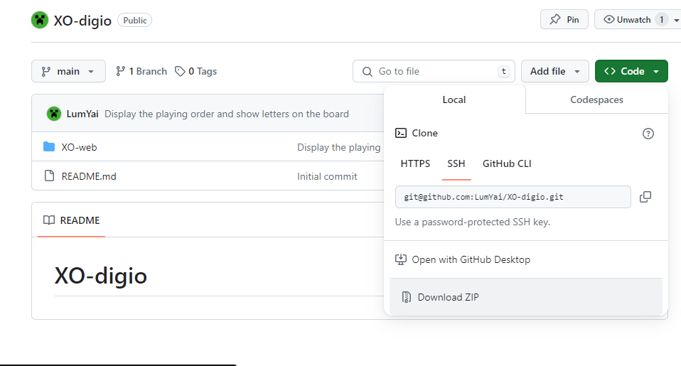
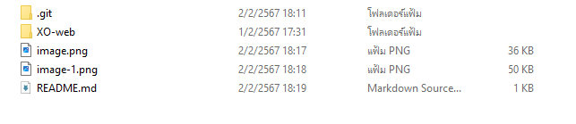
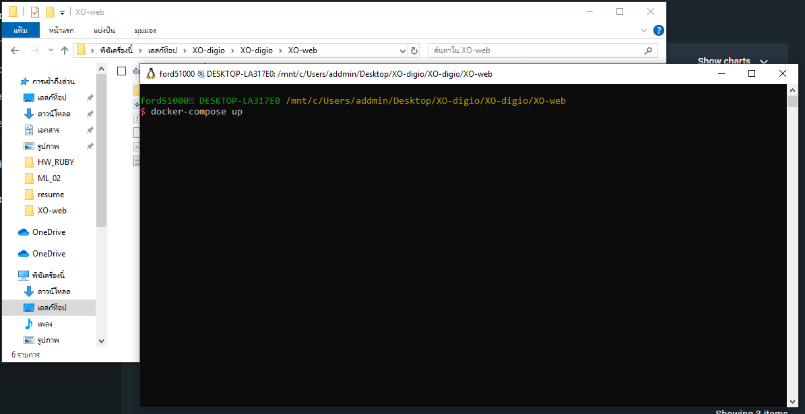
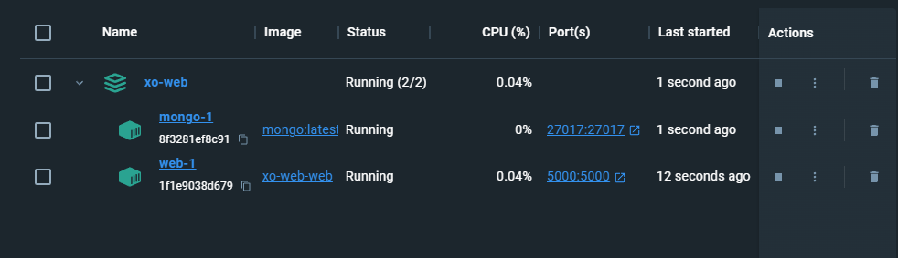
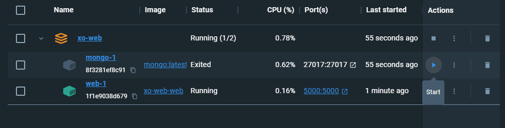

# XO-digio
วิธีการ setup, run โปรแกรม

เมื่อมาที่ repositories ให้ Dowload ZIP file และแตก file 
 
หลังจากที่แตก file แล้วจะได้หน้าตาไฟล์แบบนี้

เข้าไปที่ file XO-web และเปิด Terminal หรือ Command Prompt ที่มีไฟล์ docker-compose.yml
ใช้คำสั่ง docker-compose up เพื่อสร้าง image และ เริ่มต้น containers (ต้องเปิด Docker Desktop ก่อนใช้คำสั่ง)

หากต้องการหยุดการทำงานของ containers ใช้คำสั่ง docker-compose down

ตรวจสอบว่า containers ทำงานได้ทั้งหมด หากมี containers ที่หยุดการทำงานให้คลิก ปุ่ม Start ที่ column Actios เพื่อเริ่มทำงาน

หลังจาก containers ทำงานได้ทั้งหมด เข้าไปที่ link http://localhost:5000/ เพื่อใช้งาน web XO Game เกม

ใช้ flask สำหรับพัฒนาเว็บแอปพลิเคชันด้วยภาษา Python
mongoDB เป็น Database ในการจัดเก็บข้อมูล
Docker สำหรับการ run เว็บแอปพลิเคชัน
bootstrap สำหรับการพัฒนาเว็บแอปพลิเคชัน

เว็บนี้ได้ทำในลักษณะ single web page
มี สถานะ Turn ในการบอกผู้เล่นปัจจุบัน
ปุ่ม Restart ในการเคลียกระดานเพื่อเริ่มใหม่
ปุ่ม change size เปลี่ยนขนาดกระดาน โดย เริ่มต้นกระดานจะมีขนาด 3*3 สามารถเปลี่ยนได้ตั้งแต่ 3*3 ถึง n*n  
ปุ่ม playing history แสดงประวัติการเล่น

วิธีออกแบบโปรแกรมและ algorithm ที่ใช้
1) ขั้นตอนแรกเมื่อเริ่มโปรแกรมพยายามเขียนโปรแกรมให้ได้ XO ขนาด 3*3 ที่เป็นพื้นฐานก่อน
ซึ่งสามารถทำงานได้ปกติเหมือน XO ทั่วไป ในขั้นตอนนี้จะทำการ set ค่าที่ถูกต้องไว้ 
2) หลังจากทำ 3*3 ได้แล้วเปลี่ยนเป็น n*n โดย ได้ทำการสร้างคำตอบจากค่า n ที่รับมา เช่น n = 4 คำตอบจะมี [1, 2, 3 , 4], [5, 6, 7, 8] เป็นต้น โดยคำตอบทั้งหมดจะมี list ของทุกแถว, ทุก column และ เส้นทแยงมุม ซ้ายบนมาขวาล่าง และ ซ้ายลางไปขวาบน รวม (n*2)+2 list ของคำตอบทั้งหมด หลักการในการเช็คคำตอบคือ หาก list ของผู้เล่นใดที่มีตัวอักษรครบตามคำตอบบาง list ที่สร้างจะเป็นผู้ชนะ หากจำนวนช่องครบทั้งคู่จะเสมอ
3) เมื่อสามารถสร้าง XO ขนาด n*n ได้แล้วต่อมาทำการเชื่อมต่อ database โดยสร้าง API สำหรับส่งและรับข้อมูล โดยจะมีข้อมูลที่ส่งและรับคือ คำตอบของผู้เล่น X, O และ รอบที่เล่น โดยข้อมูลจะจัดเก็บลงบน database เมื่อมีการจบรอบการเล่นเท่านั้น
4) หลังจากทำการส่งข้อมูลเก็บ database ได้แล้วทำการดึงข้อมูลเพื่อแสดงที่หน้าประวัติการเล่น จะมีการแสดงในรูปแบบตาราง บอกจำนวนรอบ และลำดับการเล่น 

